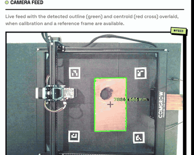
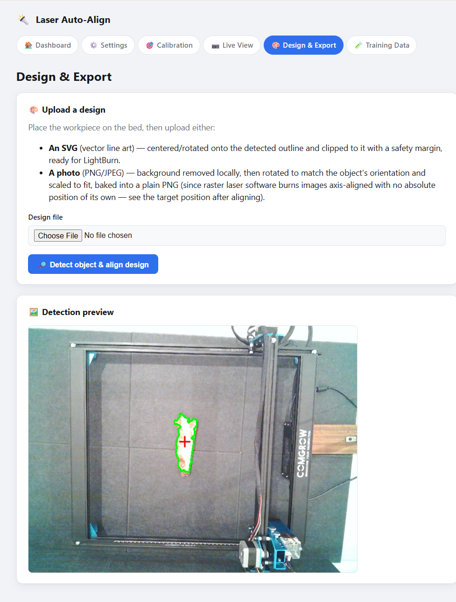
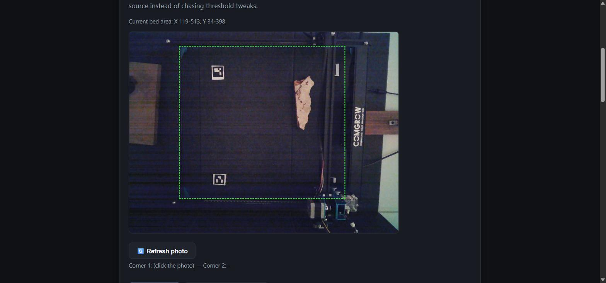
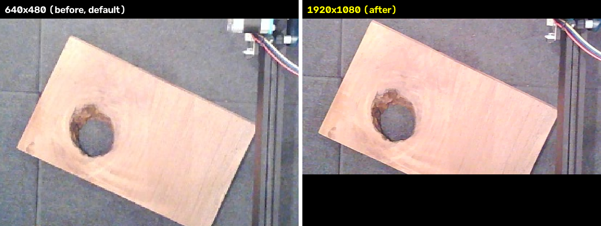
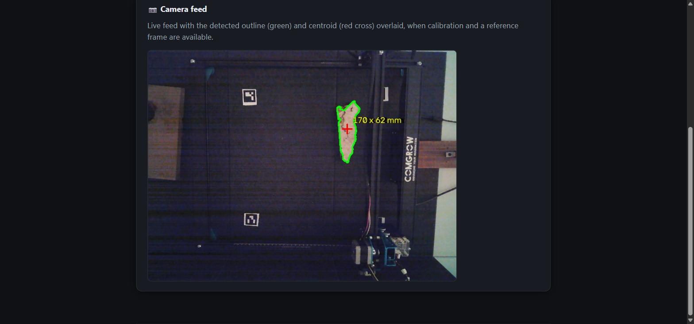

# laser-eye

**Status: still an active prototype.** Built for and tested against my own machine/setup
- calibration, detection, and export all work, but a real end-to-end burn with an
exported file hasn't happened yet, and the RF-DETR training path is built but untrained.
Expect rough edges. See `context.md` for exactly what's verified vs. still open.

My Comgrow laser engraver has no idea what's on its bed. No camera, no sensors, nothing.
So every time I wanted to engrave an oddly-shaped piece of wood, I'd end up manually
jogging the head around and eyeballing the alignment. This fixes that: point a webcam at
the bed, and it figures out where your workpiece actually is - the real outline, not
just a rough box - and lines your design up automatically.



*Placing a piece by hand - the outline locks onto it live, no manual jogging.*



*Detected outline shown before you commit to exporting anything.*

## How it works

A camera sits fixed above the bed. Once it's calibrated, it can turn any pixel in a
photo into a real machine coordinate. Finding a workpiece is just a matter of comparing
the current photo against a saved "empty bed" reference - wherever they differ is where
something got placed.

- Detects a workpiece's actual outline (not just a bounding box) via background
  subtraction against a saved reference photo of the empty bed.
- Aligns an uploaded **SVG** (vector design) to the detected outline: centered, rotated
  to match, and clipped to fit - exported ready to open in LightBurn.
- Aligns an uploaded **photo**: background removed automatically, rotated to match the
  workpiece's orientation, exported as a plain PNG (with the target position reported),
  since raster laser software burns images axis-aligned with no rotation of its own.
- Optional direct GRBL connection for jogging/calibration convenience (never for running
  burn jobs - that stays in LightBurn/LaserGRBL).
- One-click automatic calibration via 4 fixed ArUco markers, as an alternative to
  clicking through manual reference points every time.
- Optional RF-DETR-based detection as a trained-model alternative to the classical
  background-subtraction method, once enough samples are collected through the app's own
  data-collection page.

This deliberately does **not** generate G-code or run burn jobs itself - it exports a
ready-to-run file, and you open that in LightBurn or LaserGRBL to actually fire the
laser. Rebuilding a whole G-code engine (power curves, raster DPI, safety limits, all of
it) wasn't worth it when LightBurn already does that well.

## Design log

Real problems hit building this, the evidence that pinned them down, and the decision
made each time. Chronological. This is the highlight reel - `context.md` has the full
version of every entry below, plus more that didn't make the cut here.

**Hybrid run-time, not a full G-code engine.**
Originally considered generating and streaming G-code directly instead of exporting a
file for LightBurn to open. Reimplementing raster/vector engraving (power curves,
DPI/line spacing, overscan, safety limits) from scratch is a huge, already-solved
problem. Decision: this app only does vision + alignment; LightBurn/LaserGRBL still owns
the actual burn.

**Grayscale background-subtraction missed wood grain.**
Problem: the first detector diffed on grayscale only. Wood grain dark enough to match
the mat's brightness produced *holes* in the detected mask - only the bright outer rim
of a piece registered, not the whole shape. Evidence: diagnostic mask images against a
real photo of the user's wood piece showed the interior gap directly. Decision: diff
across all three color channels instead of collapsing to grayscale first (color, not
just brightness, separates wood from mat), switch to an Otsu-auto threshold, and fill
the traced contour solid before use - a real workpiece has no holes, so gaps in the diff
signal shouldn't punch any into the detected silhouette either.

**Oversized morphology kernels erased real edge detail.**
Problem: detected outlines came back smoothed into a rounded blob, losing all the
workpiece's actual jagged edge. Evidence: measured the object at only 43px wide in the
640x480 frame - the 15x15 closing kernel then in use was erasing roughly 35% of the
object's own width on each pass. Decision: shrink both kernels to 3x3 (and the pre-diff
blur from 9x9 to 3x3) - safe only because the fill-solid step above already handles
interior holes unconditionally, so the closing kernel's only remaining job is bridging
tiny boundary gaps, which a much smaller kernel does fine.

**A contaminated reference frame produced a two-lobed phantom outline.**
Problem: a genuinely bizarre two-lobed detected shape, half real, half nothing. Evidence:
traced to the saved "empty bed" reference photo not actually being empty - a different,
larger offcut was still sitting on it from earlier testing, so "wood disappeared" and
"wood appeared" both read as "different from reference." Not a code bug: a reminder that
a wrong reference photo produces failures that look exactly like a precision problem
until you check the reference photo itself.

**Smaller kernels (needed for precision) let frame/cable noise back in.**
Problem: after fixing the kernel-size bug above, false detections started tracing along
the machine frame, cables, and belt track - fine repeating texture sensitive to small
exposure/vibration shifts between reference and current frame, no longer smoothed away
by the (now smaller, correctly so) kernels. No single global threshold is simultaneously
sensitive enough for a 43px object and blind to frame texture. Decision: an optional bed
ROI (`bed_roi_px`, set via a two-click corner picker on the Calibration page) zeroes the
diff outside the working area before Otsu/contours ever run - the frame/cables can never
legitimately have a workpiece on them, so excluding them is correct, not a tuning
compromise.



*The two-click ROI picker in practice - only the dashed box is ever searched for a
workpiece, so the frame/cables/belt track outside it can't produce false detections no
matter how noisy they get.*

**The ROI fix itself had two bugs, found from real screenshots after use.**
Problem 1: zero-padding outside the ROI before running Otsu skewed its histogram badly -
measured 13-14 on the ROI alone vs. 7 after zero-padding, low enough that ordinary sensor
noise inside the ROI started reading as foreground. Fixed by running Otsu on the ROI crop
directly, then placing that mask into a full-frame-sized zero array. Problem 2: a
residual ~2,400px noise blob still passed the area filter on a genuinely empty bed - too
close in pixel area to a real 43px-wide object (~2,880px) to separate by area alone.
Fixed with two better-separated, directly-measured signals a candidate contour must both
clear: mean diff magnitude inside it (noise ~20, real object ~200+, threshold 60) and
solidity (noise ~0.31, real object ~0.77-0.79 even when jagged, threshold 0.5).

**Real-world dimensions exposed a degenerate calibration.**
Problem: added `length_mm`/`width_mm` (oriented `cv2.minAreaRect` on the detected
contour, converted through the homography) so the app reports how big a piece actually
is - first real reading came back 287,007mm. Evidence: the saved calibration's 4 points
were pixel-clustered into a 282x117px band, only 44% of frame width / 24% of height -
a homography fit from a cluster like that reproduces those points exactly and
extrapolates wildly anywhere else, which is exactly where the real workpiece was. Third
distinct calibration-data-quality failure this project hit (after duplicate points and
physically-impossible saved values). Decision: guard it in code instead of relying on UI
instructions alone - `compute_homography()` now rejects a save if either pixel axis
spans less than 35% of the frame.

**The camera had been running at 640x480 the entire project.**
Problem: OpenCV/DSHOW default to 640x480 unless a higher resolution is explicitly
requested, and nothing in the app ever did - the single biggest precision lever
available was sitting unused. Evidence: checked the camera directly and confirmed it
supports up to 1920x1080; roughly 3x finer resolution (~0.63mm/px down to ~0.21mm/px on
a 400mm bed) for free, same object, same lighting, same spot on the bed:



*Same piece, same lighting, same position - just more pixels to work with. The 1080p
capture resolves the grain-vs-hole boundary and the plank's true edges much more
cleanly.*

Decision: wired resolution through as a real setting (`camera_width`/`camera_height`,
a picker on the Settings page), not a hardcoded bump - raising it invalidates any saved
calibration/bed-ROI (both are pixel coordinates tied to the resolution they were
captured at), so a resolution change now deliberately clears both instead of leaving
them silently misaligned. Also had to make the object-size floor resolution-independent
(a fraction of frame area, not an absolute pixel count) since the same physical object
covers proportionally more pixels at a higher resolution.

**Concurrent requests on the shared camera/GRBL objects crashed the whole process.**
Problem: silent process death, no Python traceback, happening unpredictably throughout
the project. Evidence: the live camera view polls continuously while other requests
(snapshots, jogging) land at the same time - Flask runs `threaded=True`, so multiple
request threads were hitting the same shared `Camera`/`Grbl` object with zero
synchronization; concurrent reads/writes on the same serial/camera handle from different
threads caused native-level crashes no Python `try`/`except` could catch. Decision: wrap
every public method on both classes in a `threading.RLock()`. Stress-tested with
deliberately concurrent requests against both - confirmed fixed, and very likely the
actual cause of most of the earlier "server just died" incidents in this project.

**A dropped serial connection crashed every subsequent GRBL request.**
Problem: when the CH340 adapter's connection actually drops (electrical noise right as a
limit switch tripped, on real hardware), pyserial raises `serial.SerialException` - not
a subclass of this project's own `GrblError`, so it went uncaught everywhere, including
the position poll running every 1.5s, making the jog panel look permanently broken.
Decision: wrap the lowest-level serial I/O calls to convert `SerialException` into
`GrblError`, and drop the stale global connection automatically (`is_broken` flag) so the
UI shows a clean "not connected" instead of repeating the same failing call forever.

**Manual calibration was repetitive enough that people would stop doing it.**
Problem: any camera bump meant re-clicking 4+ points by hand, which meant recalibrating
was something to avoid rather than routine maintenance. Decision: fixed ArUco markers
(`cv2.aruco`, `DICT_4X4_50`) taped permanently outside the work area, each registered to
a real machine position once, ever. "Calibrate now" detects whichever registered markers
are currently visible and feeds them into the exact same `save_calibration()` function
manual entry uses, so the spread guard above applies automatically and the output is an
ordinary `calibration.json` - nothing downstream can tell how it was produced.

**The ArUco path reintroduced the exact bug the spread guard didn't cover.**
Problem: first real use of auto-calibration reported detected dimensions as "0 x 0mm."
Evidence: two of the four calibration points had *identical* machine coordinates
(370, 0mm) from different pixel locations - a marker position was mistyped during
registration - which collapsed an entire row of the fitted homography matrix to ~0,
mapping every point to Y=0 regardless of input. The outline still looked visually
correct on screen (the overlay draws raw pixel coordinates, unaffected by the broken
matrix), which made this look like a cosmetic label bug at first; it wasn't - alignment
and export would have been silently wrong too. Root cause: the duplicate-point check
existed but was only wired into the manual-entry route, not the newer ArUco one.
Decision: move the check into `compute_homography()` itself so every entry path -
manual, ArUco, anything added later - is protected by the same code, not by each route
remembering to call it.



*Live detection today, after both calibration bugs above - a real dimension label
instead of "0 x 0mm" or six-figure nonsense, on a real piece.*

## Hardware you'll need

- A GRBL-based engraver (built against a Comgrow machine)
- A webcam mounted somewhere fixed above the bed - it can't move once calibrated
- A plain, matte mat under the work area helps a lot with detection accuracy, and
  consistent lighting matters more than you'd think

## Getting it running

```
python -m venv .venv
.venv\Scripts\python -m pip install -r requirements.txt
.venv\Scripts\python app.py
```

Then open `http://localhost:5000`. First time through: set your camera and bed size in
Settings, then head to Calibration - capture an empty-bed reference photo, mark out the
actual bed area, and add a few reference points (or register 4 ArUco markers once and
use "Calibrate now" from then on). After that it's just Design & Export for every job.

RF-DETR needs its own CUDA-matched PyTorch install if you want to use it - see
`CLAUDE.md` for the exact commands.

## More detail

- `CLAUDE.md` - how the code is actually organized, module by module
- `context.md` - the long version: every decision made building this and why, plus the
  real bugs hit along the way, in full

## Safety

This controls a real laser and a real motorized machine. The direct GRBL connection
(used only for jogging during calibration) forces the laser off whenever it's active,
and never sends a fire command under any circumstance - but it does physically move the
machine, including toward its limit switches. Watch the machine while jogging, don't
leave it running unattended, and treat this like any other piece of code driving
hardware: read it before you run it, and don't trust it blindly. Use at your own risk.

## License

MIT - see `LICENSE`.

---

Made by [saleh-sabti](https://github.com/saleh-sabti)
